# MachShop MES - Architecture Visual Diagrams

**Date**: November 1, 2025
**Framework Version**: 2.0.0
**Status**: Complete

---

## Table of Contents

1. [Capability Hierarchy Visualization](#capability-hierarchy-visualization)
2. [Extension Framework Architecture](#extension-framework-architecture)
3. [L0 Platform Core Dependencies](#l0-platform-core-dependencies)
4. [L1 Foundational Extensions](#l1-foundational-extensions)
5. [L2 Domain Extensions](#l2-domain-extensions)
6. [Extension Points & Hooks](#extension-points--hooks)
7. [Data Flow & Integration](#data-flow--integration)
8. [Deployment Architecture](#deployment-architecture)

---

## Capability Hierarchy Visualization

```mermaid
graph TB
    subgraph L0["L0: Platform Core (28 capabilities, 64% implemented)"]
        A["🔐 Authentication & Authorization (9, 100%)"]
        B["💾 Core Data Management (8, 75%)"]
        C["🔌 Integration Infrastructure (5, 40%)"]
        D["📊 Monitoring & Observability (4, 100%)"]
        E["⚖️ Compliance & Security (2, 0%)"]
    end

    subgraph L1["L1: Foundational Extensions (25 capabilities, 56% implemented)"]
        F["🏭 Manufacturing Execution (9, 67%)"]
        G["✅ Quality Management (7, 43%)"]
        H["🔗 Integration & Data Exchange (6, 50%)"]
        I["⚙️ Configuration & Customization (3, 67%)"]
    end

    subgraph L2["L2: Domain Extensions (56 capabilities, 59% implemented)"]
        J["🚀 Advanced Manufacturing (12, 50%)"]
        K["🔍 Advanced Quality (11, 45%)"]
        L["🌐 Advanced Integration (10, 40%)"]
        M["📈 Advanced Analytics (12, 55%)"]
        N["📋 Compliance & Regulatory (11, 45%)"]
    end

    L0 --> L1
    L1 --> L2

    style A fill:#4CAF50
    style B fill:#4CAF50
    style C fill:#FF9800
    style D fill:#4CAF50
    style E fill:#F44336
    style F fill:#FF9800
    style G fill:#FF9800
    style H fill:#FF9800
    style I fill:#4CAF50
    style J fill:#FF9800
    style K fill:#FF9800
    style L fill:#FF9800
    style M fill:#FF9800
    style N fill:#FF9800
```



**Legend**:
- 🟢 Green = >75% Implemented
- 🟠 Orange = 50-75% Implemented
- 🔴 Red = <50% or Not Implemented

---

## Extension Framework Architecture

```mermaid
graph LR
    subgraph Client["🖥️ Client Layer (React 18.2+)"]
        UI["UI Components"]
        Router["Router"]
        Store["State Management"]
    end

    subgraph Extension["🔌 Extension Layer"]
        Hooks["🪝 Hook System"]
        Adapters["🔗 Adapters"]
        Middleware["⚡ Middleware"]
        Config["⚙️ Configuration"]
    end

    subgraph Core["🏗️ Platform Core (L0)"]
        Auth["Authentication"]
        DataMgmt["Data Management"]
        API["REST API"]
        Integration["Integration Infra"]
    end

    subgraph Services["📦 Services Layer (230+)"]
        MES["Manufacturing Services"]
        Quality["Quality Services"]
        Data["Data Services"]
        Integration_Svc["Integration Services"]
    end

    subgraph Data["💾 Data Layer"]
        DB["PostgreSQL"]
        Cache["Redis"]
        Queue["BullMQ"]
    end

    Client -->|Uses| Router
    Router -->|Renders| UI
    UI -->|Dispatches| Store
    Store -->|Calls via Hooks| Extension

    Extension -->|Enhances| Core
    Extension -->|Calls| Services

    Core -->|Uses| Services
    Services -->|Accesses| Data

    style Client fill:#E3F2FD
    style Extension fill:#FFF3E0
    style Core fill:#F3E5F5
    style Services fill:#E8F5E9
    style Data fill:#FCE4EC
```



---

## L0 Platform Core Dependencies

```mermaid
graph TB
    subgraph L0["L0 Platform Core"]
        Auth["🔐 Authentication & Authorization"]
        Data["💾 Data Management"]
        Infra["🔌 Integration Infrastructure"]
        Monitor["📊 Monitoring & Observability"]
        Compliance["⚖️ Compliance & Security"]
    end

    subgraph Systems["External Systems"]
        OAuth["OAuth/OIDC Providers"]
        LDAP["LDAP/AD"]
        IdP["Identity Provider"]
        Secrets["Secrets Manager"]
        APM["APM Solutions"]
    end

    Auth --> OAuth
    Auth --> LDAP
    Auth --> IdP
    Compliance --> Secrets
    Monitor --> APM

    subgraph Libs["Core Libraries"]
        JWT["JWT Library"]
        Prisma["Prisma ORM"]
        Zod["Zod Validation"]
        Pino["Pino Logger"]
    end

    Auth --> JWT
    Data --> Prisma
    Data --> Zod
    Monitor --> Pino

    style Auth fill:#4CAF50
    style Data fill:#4CAF50
    style Infra fill:#FF9800
    style Monitor fill:#4CAF50
    style Compliance fill:#F44336
```



---

## L1 Foundational Extensions


---

## L2 Domain Extensions


---

## Extension Points & Hooks

```mermaid
graph LR
    subgraph HookTypes["Hook Types (5 defined, 30+ instances)"]
        WF["🔄 WORKFLOW<br/>Pre/Post processing"]
        UI["🎨 UI<br/>Component overrides"]
        DATA["💾 DATA<br/>Before save/load"]
        INTEG["🔌 INTEGRATION<br/>External systems"]
        NOTIF["📢 NOTIFICATION<br/>Events"]
    end

    subgraph Adapters["Adapter Pattern (14 adapters)"]
        ERP_A["ERP Adapter"]
        PLM_A["PLM Adapter"]
        MQTT_A["MQTT Adapter"]
        OPC_A["OPC-UA Adapter"]
        SAP_A["SAP Connector"]
        Salesforce_A["Salesforce Connector"]
        Azure_A["Azure Integration"]
        Snowflake_A["Snowflake Connector"]
        Other_A["8 Other Adapters"]
    end

    subgraph Middleware["Middleware Chain (19 components)"]
        Auth_M["Auth Middleware"]
        Log_M["Logging Middleware"]
        Rate_M["Rate Limiting"]
        Cache_M["Cache Management"]
        Other_M["15 Other Middleware"]
    end

    subgraph Config["Configuration Hierarchy"]
        System["System Level"]
        Enterprise["Enterprise Level"]
        Site["Site Level"]
    end

    subgraph Webhook["Webhook/Event System"]
        BullMQ["BullMQ Job Queue"]
        AsyncDeliver["Async Delivery"]
        Retry["Retry Logic"]
        DLQ["Dead Letter Queue"]
    end

    style HookTypes fill:#FFF3E0
    style Adapters fill:#FFF3E0
    style Middleware fill:#FFF3E0
    style Config fill:#FFF3E0
    style Webhook fill:#FFF3E0
```



---

## Missing Extension Points

```mermaid
graph TB
    subgraph Existing["✅ Existing Extension Points"]
        E1["🪝 Hook System"]
        E2["🔗 Adapter Pattern"]
        E3["⚡ Middleware Chain"]
        E4["⚙️ Configuration Hierarchy"]
        E5["📢 Event Bus/Webhooks"]
    end

    subgraph Missing["❌ Missing Extension Points (Blocking Enterprise Adoption)"]
        M1["🎨 UI Component Override<br/>(Phase 3 work #426)"]
        M2["💾 Database Schema Extension<br/>(Plugins can't extend schema)"]
        M3["🛣️ Dynamic Route Registration<br/>(No plugin-contributed endpoints)"]
        M4["💉 Service Locator/DI Container<br/>(BaseService underutilized)"]
        M5["📦 Custom Entity & Enum<br/>(Can't extend Prisma schema)"]
        M6["📄 Report Template Extension<br/>(No plugin templates)"]
    end

    Existing -.->|Enables| M1
    Existing -.->|Requires| M2
    Existing -.->|Requires| M3
    Existing -.->|Requires| M4
    Existing -.->|Requires| M5
    Existing -.->|Requires| M6

    style Existing fill:#4CAF50
    style Missing fill:#F44336
```



---

## Data Flow & Integration

```mermaid
graph TB
    subgraph External["External Systems"]
        ERP["📊 ERP Systems<br/>(SAP, Oracle, etc.)"]
        PLM["📐 PLM Systems<br/>(Windchill, Teamcenter)"]
        IoT["📡 IoT Devices<br/>(MQTT, OPC-UA)"]
        BI["📈 BI Tools<br/>(Tableau, Power BI)"]
    end

    subgraph Adapters_Layer["Adapter Layer"]
        Adapter1["ERP Adapter"]
        Adapter2["PLM Adapter"]
        Adapter3["IoT Adapter"]
        Adapter4["BI Adapter"]
    end

    subgraph Integration_Hub["Integration Hub<br/>(Event Bus/Webhook)"]
        Queue["BullMQ Queue"]
        Transform["Data Transform"]
        Validate["Validation"]
    end

    subgraph Services["MachShop Services"]
        WorkOrder["Work Order Service"]
        Quality["Quality Service"]
        Material["Material Service"]
        Equipment["Equipment Service"]
    end

    subgraph Database["Data Layer"]
        Primary["PostgreSQL<br/>(Primary)"]
        TimeSeries["TimescaleDB<br/>(Metrics)"]
        Cache["Redis<br/>(Cache)"]
    end

    ERP --> Adapter1
    PLM --> Adapter2
    IoT --> Adapter3
    BI --> Adapter4

    Adapter1 --> Queue
    Adapter2 --> Queue
    Adapter3 --> Queue
    Adapter4 --> Queue

    Queue --> Transform
    Transform --> Validate
    Validate --> Services

    Services --> Primary
    Services --> TimeSeries
    Services --> Cache

    style External fill:#E3F2FD
    style Adapters_Layer fill:#FFF3E0
    style Integration_Hub fill:#F3E5F5
    style Services fill:#E8F5E9
    style Database fill:#FCE4EC
```



---

## Deployment Architecture


---

## Capability Coverage by Domain


---

## Phase Implementation Roadmap

```mermaid
gantt
    title MachShop MES - 4-Phase Capability Implementation Roadmap (40 Weeks)

    section Phase 1
    UI Framework & Schema Extension :phase1a, 0, 4w
    Dynamic Routes & DI Container :phase1b, 0, 4w

    section Phase 2
    Digital Work Instructions :phase2a, 4w, 4w
    E-Signatures & FAI :phase2b, 4w, 4w
    ERP/PLM Integration :phase2c, 4w, 4w
    IoT Sensor Integration :phase2d, 4w, 4w

    section Phase 3
    SPC Framework :phase3a, 8w, 4w
    Certificate of Conformance :phase3b, 8w, 4w
    Advanced Scheduling :phase3c, 8w, 4w
    CMMS Integration :phase3d, 8w, 4w

    section Phase 4
    Mobile App :phase4a, 12w, 7w
    Model-Based Engineering :phase4b, 12w, 7w
    Predictive Analytics :phase4c, 12w, 7w

    section Milestones
    Phase 1 Complete :milestone1, 4w, 0d
    Phase 2 Complete :milestone2, 8w, 0d
    Phase 3 Complete :milestone3, 12w, 0d
    Phase 4 Complete :milestone4, 19w, 0d
```

---

## Summary Statistics


---

**Document**: ARCHITECTURE_VISUAL_DIAGRAMS.md
**Version**: 1.0.0
**Created**: November 1, 2025
**Format**: Mermaid diagrams (GitHub-compatible)
