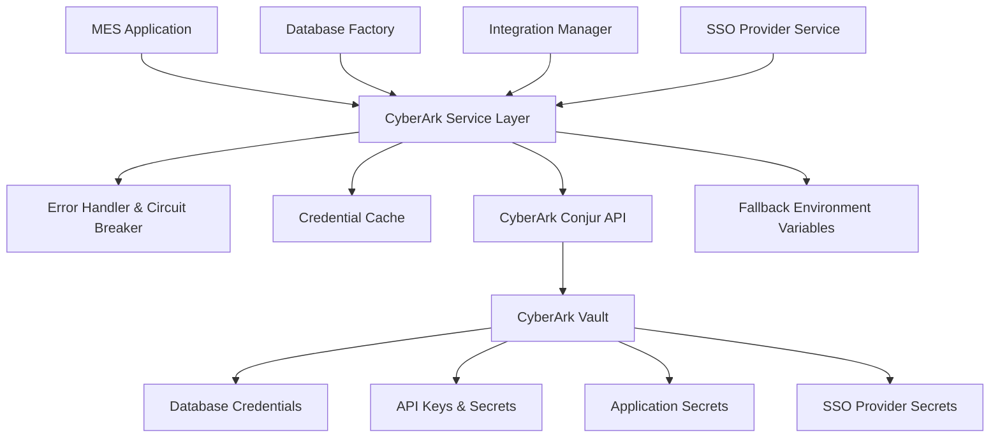

# CyberArk Privileged Access Management (PAM) Integration

## Overview

This document describes the comprehensive CyberArk PAM integration for the Manufacturing Execution System (MES), providing enterprise-grade credential management, automatic rotation, and enhanced security compliance for aerospace manufacturing operations.

## Table of Contents

1. [Architecture Overview](#architecture-overview)
2. [Security Benefits](#security-benefits)
3. [Compliance & Standards](#compliance--standards)
4. [Configuration](#configuration)
5. [Deployment](#deployment)
6. [Migration Process](#migration-process)
7. [Monitoring & Operations](#monitoring--operations)
8. [Troubleshooting](#troubleshooting)
9. [API Reference](#api-reference)
10. [Best Practices](#best-practices)

## Architecture Overview

### CyberArk Integration Components



### Service Architecture

The CyberArk integration follows a microservices-friendly architecture:

- **CyberArkService**: Core credential retrieval and management
- **DatabaseFactory**: Dynamic database connections with CyberArk credentials
- **CyberArkErrorHandler**: Circuit breaker, retry logic, and error handling
- **Migration Tool**: Automated credential migration utilities

### Credential Organization in CyberArk Vault

```
/MES/
├── application/
│   ├── jwt_secret
│   ├── session_secret
│   └── encryption_key
├── database/
│   ├── auth/
│   │   ├── username
│   │   └── password
│   ├── work-order/
│   │   ├── username
│   │   └── password
│   ├── quality/
│   │   ├── username
│   │   └── password
│   └── [other services...]
├── integration/
│   ├── erp/oracle_fusion/
│   │   ├── username
│   │   ├── password
│   │   └── client_secret
│   ├── plm/teamcenter/
│   │   ├── username
│   │   └── password
│   └── [other integrations...]
└── sso/
    ├── azure_ad/{tenant_id}/
    │   ├── client_id
    │   └── client_secret
    └── saml/{provider_name}/
        └── certificate
```

## Security Benefits

### Enterprise-Grade Security

1. **Centralized Credential Management**
   - Single source of truth for all credentials
   - Eliminates hardcoded passwords in configuration files
   - Centralized rotation and lifecycle management

2. **Zero Trust Security Model**
   - Every credential request is authenticated and authorized
   - Granular access controls per service and credential type
   - Comprehensive audit trails for compliance

3. **Automatic Credential Rotation**
   - Seamless rotation without application downtime
   - Coordinated updates across all service instances
   - Cache invalidation during rotation cycles

4. **Enhanced Monitoring & Alerting**
   - Real-time monitoring of credential access
   - Anomaly detection for unusual access patterns
   - Integration with SIEM systems for security analytics

### Defense in Depth

- **Circuit Breaker Pattern**: Prevents cascade failures during PAM system outages
- **Fallback Mechanisms**: Graceful degradation to environment variables
- **Encrypted Transport**: All communications use TLS/SSL encryption
- **Credential Caching**: Time-limited caching to reduce network calls
- **Retry Logic**: Exponential backoff with jitter for resilience

## Compliance & Standards

### Aerospace Industry Standards

#### AS9100 Section 8.3.6 - Configuration Management
- **Requirement**: Control of configuration items and documents
- **Implementation**: CyberArk provides centralized control and audit trails for all credential configurations
- **Evidence**: Automated logging of all credential access and changes

#### NIST AMS 300-12 - Digital Thread Standards
- **Requirement**: Secure data exchange across enterprise systems
- **Implementation**: UUID-based traceability with PAM-secured API credentials
- **Evidence**: End-to-end credential audit trails supporting digital thread integrity

#### NIST 800-171 Section 3.5.10 - Cryptographic Protection
- **Requirement**: Protect CUI with cryptographic mechanisms
- **Implementation**: Industry-standard encryption for credential storage and transmission
- **Evidence**: CyberArk FIPS 140-2 Level 2 compliance certification

### Enterprise Compliance

#### SOC 2 Type II - Security & Availability
- **CC6.1 Logical Access**: Role-based access controls for credential management
- **CC6.2 Authentication**: Multi-factor authentication for PAM access
- **CC6.3 Authorization**: Principle of least privilege enforcement
- **CC7.1 System Monitoring**: Comprehensive logging and monitoring

#### GDPR Article 32 - Security of Processing
- **Requirement**: Technical and organizational security measures
- **Implementation**: Encryption, access controls, and audit capabilities
- **Evidence**: Data protection impact assessment documentation

## Configuration

### Environment Variables

#### Required Configuration

```bash
# Enable CyberArk integration
CYBERARK_ENABLED=true

# CyberArk Conjur server configuration
CYBERARK_URL=https://conjur.company.com
CYBERARK_ACCOUNT=production-mes
CYBERARK_AUTHENTICATOR=authn

# Authentication (choose one method)
CYBERARK_API_KEY=your-api-key                    # Option 1: API Key
CYBERARK_USERNAME=mes-service-account            # Option 2: Username/Password
CYBERARK_PASSWORD=secure-password

# Client certificate authentication (Option 3)
CYBERARK_CLIENT_CERT_PATH=/etc/ssl/certs/conjur-client.crt
CYBERARK_CLIENT_KEY_PATH=/etc/ssl/private/conjur-client.key
CYBERARK_CA_CERT_PATH=/etc/ssl/certs/conjur-ca.crt
```

#### Optional Configuration

```bash
# Performance tuning
CYBERARK_CACHE_TTL=300000        # 5 minutes (milliseconds)
CYBERARK_TIMEOUT=30000           # 30 seconds (milliseconds)

# Circuit breaker configuration
CYBERARK_CIRCUIT_BREAKER_THRESHOLD=5
CYBERARK_CIRCUIT_BREAKER_RESET_TIMEOUT=60000

# Retry configuration
CYBERARK_RETRY_MAX_ATTEMPTS=3
CYBERARK_RETRY_BASE_DELAY=1000
CYBERARK_RETRY_MAX_DELAY=10000
CYBERARK_RETRY_EXPONENTIAL_BASE=2
CYBERARK_RETRY_JITTER=true
```

### Fallback Configuration

When CyberArk is unavailable, the system can fallback to environment variables:

```bash
# Database credential fallbacks
FALLBACK_AUTH_USERNAME=mes_auth_user
FALLBACK_AUTH_PASSWORD=dev_password_auth
FALLBACK_WORK_ORDER_USERNAME=mes_work_order_user
FALLBACK_WORK_ORDER_PASSWORD=dev_password_work_order

# Application secret fallbacks
FALLBACK_JWT_SECRET=your-super-secret-jwt-key-at-least-32-characters-long
FALLBACK_SESSION_SECRET=your-super-secret-session-key-at-least-32-characters
```

## Deployment

### Development Environment

```bash
# 1. Install dependencies
npm install

# 2. Configure CyberArk (disabled by default)
cp .env.example .env
# Edit .env to set CYBERARK_ENABLED=false for development

# 3. Start application
npm run dev
```

### Staging Environment

```bash
# 1. Enable CyberArk integration
CYBERARK_ENABLED=true
CYBERARK_URL=https://conjur-staging.company.com
CYBERARK_ACCOUNT=staging-mes

# 2. Configure authentication
CYBERARK_API_KEY=staging-api-key

# 3. Test connectivity
npx tsx src/tools/cyberark-migration.ts --dry-run
```

### Production Environment

#### Kubernetes Deployment

```yaml
# CyberArk configuration ConfigMap
apiVersion: v1
kind: ConfigMap
metadata:
  name: cyberark-config
  namespace: mes-production
data:
  CYBERARK_ENABLED: "true"
  CYBERARK_URL: "https://conjur.company.com"
  CYBERARK_ACCOUNT: "production-mes"
  CYBERARK_AUTHENTICATOR: "authn-k8s/production"
  CYBERARK_CACHE_TTL: "300000"
  CYBERARK_TIMEOUT: "30000"

---
# Secret for CyberArk authentication
apiVersion: v1
kind: Secret
metadata:
  name: cyberark-credentials
  namespace: mes-production
type: Opaque
data:
  api-key: <base64-encoded-api-key>

---
# Deployment with CyberArk integration
apiVersion: apps/v1
kind: Deployment
metadata:
  name: mes-backend
  namespace: mes-production
spec:
  template:
    spec:
      containers:
      - name: mes-backend
        image: mes/backend:latest
        envFrom:
        - configMapRef:
            name: cyberark-config
        env:
        - name: CYBERARK_API_KEY
          valueFrom:
            secretKeyRef:
              name: cyberark-credentials
              key: api-key
```

#### Docker Compose

```yaml
version: '3.8'

services:
  mes-backend:
    image: mes/backend:latest
    environment:
      CYBERARK_ENABLED: "true"
      CYBERARK_URL: "https://conjur.company.com"
      CYBERARK_ACCOUNT: "production-mes"
      CYBERARK_API_KEY: "${CYBERARK_API_KEY}"
    volumes:
      - /etc/ssl/certs/conjur-ca.crt:/etc/ssl/certs/conjur-ca.crt:ro
    networks:
      - mes-network

networks:
  mes-network:
    driver: bridge
```

## Migration Process

### Phase 1: Pre-Migration Planning

1. **Assessment & Discovery**
   ```bash
   npx tsx src/tools/cyberark-migration.ts --discover
   ```

2. **Create Migration Plan**
   ```bash
   npx tsx src/tools/cyberark-migration.ts --plan
   ```

3. **Review and Approve**
   - Review generated migration plan
   - Validate CyberArk vault structure
   - Confirm backup and rollback procedures

### Phase 2: Migration Execution

1. **Dry Run Validation**
   ```bash
   npx tsx src/tools/cyberark-migration.ts --dry-run
   ```

2. **Execute Migration**
   ```bash
   npx tsx src/tools/cyberark-migration.ts --migrate
   ```

3. **Validate Migration**
   ```bash
   npx tsx src/tools/cyberark-migration.ts --validate
   ```

### Phase 3: Production Cutover

1. **Enable CyberArk Integration**
   ```bash
   # Update environment configuration
   CYBERARK_ENABLED=true
   ```

2. **Restart Services**
   ```bash
   # Kubernetes
   kubectl rollout restart deployment/mes-backend -n mes-production

   # Docker Compose
   docker-compose restart mes-backend
   ```

3. **Monitor Health**
   ```bash
   # Check CyberArk health endpoint
   curl -s http://localhost:3000/health/cyberark | jq .
   ```

### Phase 4: Post-Migration

1. **Remove Legacy Credentials**
   - Archive environment variable files
   - Update configuration management
   - Document new credential access patterns

2. **Configure Monitoring**
   - Set up alerting for CyberArk connectivity
   - Monitor credential access patterns
   - Configure audit log forwarding

## Monitoring & Operations

### Health Endpoints

#### CyberArk Service Health

```bash
GET /health/cyberark
```

Response:
```json
{
  "status": "healthy",
  "authenticated": true,
  "cacheSize": 15,
  "metrics": {
    "totalRequests": 150,
    "successfulRequests": 147,
    "failedRequests": 3,
    "averageResponseTime": 245,
    "fallbackUsageCount": 0
  },
  "circuitBreaker": {
    "state": "CLOSED",
    "failureCount": 0,
    "canExecute": true
  }
}
```

#### Database Connections Health

```bash
GET /health/database
```

Response:
```json
{
  "status": "healthy",
  "connections": [
    {
      "service": "auth",
      "status": "connected"
    },
    {
      "service": "work-order",
      "status": "connected"
    }
  ]
}
```

### Metrics & Alerting

#### Key Metrics to Monitor

1. **CyberArk Connectivity**
   - Success rate (target: >99.9%)
   - Response time (target: <500ms)
   - Circuit breaker state

2. **Credential Access Patterns**
   - Cache hit rate (target: >90%)
   - Fallback usage (target: <1%)
   - Failed authentication attempts

3. **Database Connection Health**
   - Connection pool utilization
   - Failed connection attempts
   - Credential rotation success rate

#### Prometheus Metrics

```javascript
// Example metrics exposed at /metrics
cyberark_requests_total{status="success"} 1500
cyberark_requests_total{status="failed"} 5
cyberark_response_time_seconds{quantile="0.95"} 0.245
cyberark_circuit_breaker_state{state="closed"} 1
cyberark_cache_hit_rate 0.92
cyberark_fallback_usage_total 0
```

#### Alerting Rules

```yaml
# Prometheus alerting rules
groups:
- name: cyberark-alerts
  rules:
  - alert: CyberArkHighErrorRate
    expr: rate(cyberark_requests_total{status="failed"}[5m]) > 0.1
    for: 2m
    labels:
      severity: warning
    annotations:
      summary: "High error rate for CyberArk requests"

  - alert: CyberArkCircuitBreakerOpen
    expr: cyberark_circuit_breaker_state{state="open"} == 1
    for: 0m
    labels:
      severity: critical
    annotations:
      summary: "CyberArk circuit breaker is open"

  - alert: CyberArkHighLatency
    expr: cyberark_response_time_seconds{quantile="0.95"} > 1.0
    for: 5m
    labels:
      severity: warning
    annotations:
      summary: "High latency for CyberArk requests"
```

## Troubleshooting

### Common Issues

#### 1. Authentication Failures

**Symptoms:**
- Error: "Authentication failed - token may be expired"
- 401 responses from CyberArk API

**Solutions:**
```bash
# Check API key validity
curl -H "Authorization: Token token=\"$CYBERARK_API_KEY\"" \
     https://conjur.company.com/api/authn/production-mes/login

# Verify username/password
curl -X POST \
     -d "$CYBERARK_PASSWORD" \
     https://conjur.company.com/api/authn/production-mes/$CYBERARK_USERNAME/authenticate

# Check certificate authentication
openssl s_client -connect conjur.company.com:443 \
                  -cert /etc/ssl/certs/conjur-client.crt \
                  -key /etc/ssl/private/conjur-client.key
```

#### 2. Network Connectivity Issues

**Symptoms:**
- Error: "Network error retrieving secret"
- Circuit breaker opening frequently

**Solutions:**
```bash
# Test network connectivity
curl -v https://conjur.company.com/health

# Check DNS resolution
nslookup conjur.company.com

# Verify firewall rules
telnet conjur.company.com 443

# Check SSL certificate
openssl s_client -connect conjur.company.com:443 -servername conjur.company.com
```

#### 3. Permission Denied Errors

**Symptoms:**
- Error: "Permission denied for secret: database/auth/password"
- 403 responses from CyberArk API

**Solutions:**
```bash
# Check role permissions in CyberArk
conjur role members production-mes:host:mes-backend

# Verify policy configuration
conjur policy show production-mes

# Test specific secret access
conjur variable value production-mes:variable:database/auth/password
```

#### 4. Circuit Breaker Issues

**Symptoms:**
- Frequent fallback to environment variables
- "Circuit breaker is OPEN" messages

**Solutions:**
```bash
# Check circuit breaker status
curl -s http://localhost:3000/health/cyberark | jq '.circuitBreaker'

# Reset circuit breaker manually
curl -X POST http://localhost:3000/admin/cyberark/reset-circuit-breaker

# Adjust circuit breaker thresholds
CYBERARK_CIRCUIT_BREAKER_THRESHOLD=10
CYBERARK_CIRCUIT_BREAKER_RESET_TIMEOUT=120000
```

### Debug Mode

Enable detailed logging for troubleshooting:

```bash
# Enable debug logging
LOG_LEVEL=debug

# CyberArk-specific debug information
DEBUG=cyberark:*

# Full debug mode
NODE_ENV=development
LOG_LEVEL=debug
DEBUG=*
```

### Emergency Procedures

#### 1. Emergency Fallback Activation

If CyberArk becomes completely unavailable:

```bash
# 1. Disable CyberArk integration immediately
CYBERARK_ENABLED=false

# 2. Ensure fallback credentials are configured
FALLBACK_AUTH_USERNAME=emergency_user
FALLBACK_AUTH_PASSWORD=emergency_password

# 3. Restart applications
kubectl rollout restart deployment/mes-backend

# 4. Monitor application health
kubectl get pods -l app=mes-backend
```

#### 2. Credential Rotation Emergency

If credentials are compromised:

```bash
# 1. Immediately rotate affected credentials in CyberArk
conjur variable values add production-mes:variable:database/auth/password

# 2. Invalidate cache
curl -X POST http://localhost:3000/admin/cyberark/invalidate-cache

# 3. Force application restart
kubectl rollout restart deployment/mes-backend

# 4. Monitor for authentication errors
kubectl logs -f deployment/mes-backend | grep -i "auth\|credential"
```

## API Reference

### CyberArkService Class

#### Constructor

```typescript
import { CyberArkService } from './services/CyberArkService';

const config: CyberArkConfig = {
  url: 'https://conjur.company.com',
  account: 'production-mes',
  apiKey: 'your-api-key',
  enabled: true
};

const cyberArkService = new CyberArkService(config);
```

#### Methods

##### initialize()

Initialize the CyberArk service and authenticate:

```typescript
await cyberArkService.initialize();
```

##### retrieveSecret(path, options?)

Retrieve a secret from CyberArk vault:

```typescript
const password = await cyberArkService.retrieveSecret('database/auth/password');

// Skip cache
const freshPassword = await cyberArkService.retrieveSecret(
  'database/auth/password',
  { skipCache: true }
);
```

##### retrieveDatabaseCredentials(service)

Get database credentials for a specific service:

```typescript
const credentials = await cyberArkService.retrieveDatabaseCredentials('auth');
// Returns: { username: 'mes_auth_user', password: 'secure_password', host: 'localhost', port: '5432', database: 'mes_auth' }
```

##### retrieveIntegrationCredentials(type, name)

Get integration credentials for external systems:

```typescript
const erpCredentials = await cyberArkService.retrieveIntegrationCredentials('erp', 'oracle_fusion');
// Returns: { username: 'erp_user', password: 'erp_pass', clientSecret: 'oauth_secret' }
```

##### retrieveApplicationSecrets()

Get application security secrets:

```typescript
const secrets = await cyberArkService.retrieveApplicationSecrets();
// Returns: { jwtSecret: '...', sessionSecret: '...', encryptionKey: '...' }
```

##### healthCheck()

Check service health and get metrics:

```typescript
const health = await cyberArkService.healthCheck();
console.log(health.status); // 'healthy' | 'degraded' | 'unhealthy'
```

##### invalidateCache(path?)

Invalidate cached credentials:

```typescript
// Invalidate specific secret
cyberArkService.invalidateCache('database/auth/password');

// Invalidate all cached secrets
cyberArkService.invalidateCache();
```

### Database Factory

#### getDatabase()

Get the main database connection with CyberArk credentials:

```typescript
import { getDatabase } from './lib/databaseFactory';

const prisma = await getDatabase();
const users = await prisma.user.findMany();
```

#### getPrismaForService(serviceName)

Get service-specific database connection:

```typescript
import { getPrismaForService } from './lib/database';

const authPrisma = await getPrismaForService('auth');
const workOrderPrisma = await getPrismaForService('work-order');
```

### Error Handling

#### CyberArkError Types

```typescript
import { CyberArkError, CyberArkErrorType } from './services/CyberArkErrorHandler';

try {
  const secret = await cyberArkService.retrieveSecret('invalid/path');
} catch (error) {
  if (error instanceof CyberArkError) {
    switch (error.type) {
      case CyberArkErrorType.SECRET_NOT_FOUND:
        console.log('Secret does not exist');
        break;
      case CyberArkErrorType.PERMISSION_DENIED:
        console.log('Access denied');
        break;
      case CyberArkErrorType.NETWORK_ERROR:
        console.log('Network connectivity issue');
        break;
    }
  }
}
```

## Best Practices

### Security Best Practices

1. **Authentication Method Selection**
   - **Development**: Username/password with limited scope
   - **Staging**: API key with staging-specific permissions
   - **Production**: Client certificates with role-based access

2. **Credential Rotation**
   - Enable automatic rotation for database passwords
   - Coordinate rotation schedules with maintenance windows
   - Test rotation procedures in staging environments

3. **Access Control**
   - Follow principle of least privilege
   - Use service-specific accounts for database access
   - Regularly audit and review access permissions

4. **Network Security**
   - Use TLS 1.2+ for all CyberArk communications
   - Implement network segmentation for PAM traffic
   - Configure firewall rules for CyberArk access

### Operational Best Practices

1. **Monitoring & Alerting**
   - Monitor CyberArk service health continuously
   - Set up alerts for circuit breaker activations
   - Track credential access patterns for anomalies

2. **Backup & Recovery**
   - Maintain emergency credential backups
   - Test fallback mechanisms regularly
   - Document emergency procedures

3. **Testing**
   - Include CyberArk integration in CI/CD pipelines
   - Test credential rotation procedures
   - Validate fallback mechanisms during outages

4. **Documentation**
   - Keep credential mapping documentation current
   - Document access patterns and dependencies
   - Maintain runbooks for common scenarios

### Performance Best Practices

1. **Caching Strategy**
   - Use appropriate cache TTL values (5-10 minutes)
   - Implement cache warming for critical credentials
   - Monitor cache hit rates and adjust accordingly

2. **Connection Management**
   - Use connection pooling for database connections
   - Implement proper connection lifecycle management
   - Monitor connection pool utilization

3. **Error Handling**
   - Implement exponential backoff for retries
   - Use circuit breaker pattern for resilience
   - Provide meaningful error messages and logging

4. **Resource Optimization**
   - Minimize unnecessary credential retrievals
   - Batch credential requests when possible
   - Use appropriate timeout values for network calls

---

## Support & Maintenance

### Support Contacts

- **Infrastructure Team**: infrastructure@company.com
- **Security Team**: security@company.com
- **CyberArk Administrators**: cyberark-admins@company.com

### Maintenance Windows

- **Regular Maintenance**: First Sunday of each month, 2:00-4:00 AM UTC
- **Emergency Maintenance**: As needed with 2-hour advance notice
- **Credential Rotation**: Weekly, automated during low-traffic periods

### Change Management

All changes to CyberArk integration must follow the standard change management process:

1. Submit change request with technical details
2. Security team review and approval
3. Testing in staging environment
4. Production deployment during maintenance window
5. Post-deployment validation and monitoring

For emergency changes, contact the on-call infrastructure team immediately.

---

*This document is maintained by the Infrastructure and Security teams. Last updated: November 2024*