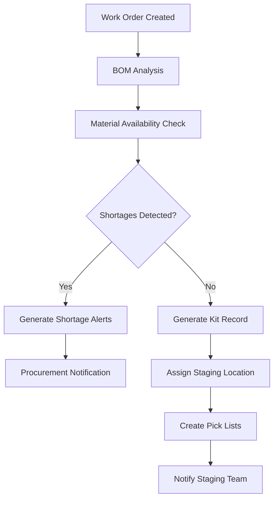
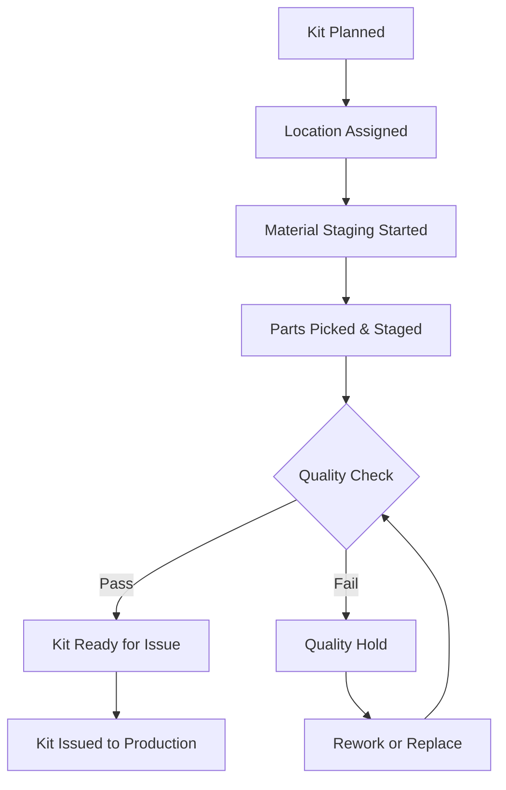

# Kitting & Material Staging System

## Overview

The Kitting & Material Staging System is an enterprise-grade solution designed for complex aerospace manufacturing environments, capable of handling 25,000+ parts from 200+ suppliers. This system automates kit generation from multi-level Bills of Materials (BOMs), optimizes staging locations, and provides comprehensive tracking and analytics.

## Key Features

### 🔧 **Kit Generation & Management**
- **Automated Kit Creation**: Generate kits from multi-level BOMs with intelligent material allocation
- **Status Workflow**: Complete kit lifecycle from planning through consumption
- **Shortage Detection**: Proactive identification of material shortages with impact analysis
- **Priority Management**: Urgent, High, Normal priority handling with escalation rules

### 📦 **Material Staging Optimization**
- **Location Intelligence**: AI-powered staging location assignment based on proximity and capacity
- **Workflow Management**: Kanban-style boards for visual status tracking
- **Capacity Planning**: Real-time utilization monitoring and optimization recommendations
- **Resource Allocation**: Automated assignment of staging personnel and equipment

### 📊 **Analytics & Reporting**
- **Real-time Dashboards**: Live monitoring of staging processes and KPIs
- **Cost Analysis**: Comprehensive cost breakdowns with optimization insights
- **Performance Metrics**: Throughput, efficiency, and quality tracking
- **Custom Reports**: Flexible report generation with multiple export formats

### 🏭 **Enterprise Integration**
- **AS9100 Compliance**: Full audit trails and regulatory compliance
- **Barcode/QR Integration**: Complete part traceability throughout the staging process
- **Vendor Kitting**: Support for vendor-supplied kits with quality control
- **ERP Integration**: Seamless connection with existing MES and ERP systems

## System Architecture

```
┌─────────────────────────────────────────────────────────────┐
│                    Frontend (React + TypeScript)            │
├─────────────────────────────────────────────────────────────┤
│  Kit Management  │  Staging Dashboard  │  Analytics & Reports │
│  - Kit Forms     │  - Status Board     │  - Cost Analysis     │
│  - Kit Lists     │  - Location Utils   │  - Report Generator  │
│  - Workflows     │  - Real-time Alerts │  - Custom Dashboards │
└─────────────────────────────────────────────────────────────┘
                               │
                               ▼
┌─────────────────────────────────────────────────────────────┐
│                     API Layer (Node.js + Express)          │
├─────────────────────────────────────────────────────────────┤
│  Kit Endpoints   │  Staging Endpoints  │  Analytics Endpoints │
│  - CRUD Ops      │  - Location Mgmt    │  - Report Generation │
│  - Status Trans  │  - Workflow Ctrl    │  - Data Aggregation  │
│  - BOM Analysis  │  - Optimization     │  - Export Services   │
└─────────────────────────────────────────────────────────────┘
                               │
                               ▼
┌─────────────────────────────────────────────────────────────┐
│                   Service Layer (TypeScript)               │
├─────────────────────────────────────────────────────────────┤
│ Kit Generation   │ Staging Location    │ Barcode Scanning    │
│ Service          │ Service             │ Service              │
│ - BOM Traversal  │ - Location Optimize │ - QR/Barcode Parse  │
│ - Kit Assembly   │ - Capacity Mgmt     │ - Validation Logic   │
│ - Shortage Alert │ - Workflow Engine   │ - Error Recovery     │
└─────────────────────────────────────────────────────────────┘
                               │
                               ▼
┌─────────────────────────────────────────────────────────────┐
│                    Database (PostgreSQL + Prisma)          │
├─────────────────────────────────────────────────────────────┤
│    Kit Data      │   Staging Data      │    Analytics Data   │
│ - Kit Records    │ - Location Info     │ - Performance Metrics│
│ - Kit Items      │ - Assignments       │ - Cost Breakdowns   │
│ - Status History │ - Utilization       │ - Audit Trails      │
└─────────────────────────────────────────────────────────────┘
```

## Quick Start

### Prerequisites
- Node.js 18+
- PostgreSQL 14+
- npm or yarn package manager

### Installation

1. **Clone the repository**
   ```bash
   git clone <repository-url>
   cd MachShop
   ```

2. **Install dependencies**
   ```bash
   npm install
   ```

3. **Set up environment variables**
   ```bash
   cp .env.example .env
   # Edit .env with your database credentials and configuration
   ```

4. **Initialize the database**
   ```bash
   npx prisma migrate dev
   npx prisma generate
   npx prisma db seed
   ```

5. **Start the development server**
   ```bash
   npm run dev
   ```

### First-Time Setup

1. **Access the application** at `http://localhost:3000`
2. **Configure staging locations** in the Location Management panel
3. **Import BOM data** through the Data Import wizard
4. **Set up user roles** and permissions
5. **Configure barcode scanners** and label printers

## User Roles & Permissions

### **Production Manager**
- Full system access
- Kit planning and optimization
- Resource allocation decisions
- Performance analytics review

### **Staging Coordinator**
- Kit status management
- Location assignments
- Workflow coordination
- Team task distribution

### **Staging Operator**
- Kit assembly and staging
- Barcode scanning operations
- Status updates and issue reporting
- Quality control checks

### **Quality Inspector**
- Kit inspection and approval
- Quality metrics review
- Non-conformance reporting
- Audit trail access

## Core Workflows

### 1. Kit Generation Process


### 2. Staging Workflow


## Documentation Structure

- **[User Guides](./user-guides/)** - Step-by-step instructions for each user role
- **[API Documentation](./api/)** - Complete API reference and integration guides
- **[Admin Guide](./admin/)** - System administration and configuration
- **[Deployment](./deployment/)** - Production deployment and scaling guides
- **[Training Materials](./training/)** - Onboarding and training resources

## Support & Maintenance

### Technical Support
- **Documentation**: Comprehensive guides and troubleshooting
- **Issue Tracking**: GitHub Issues for bug reports and feature requests
- **Community**: Discussion forums and knowledge base

### System Monitoring
- **Health Checks**: Automated system health monitoring
- **Performance Metrics**: Real-time performance dashboards
- **Alert System**: Proactive notification of system issues

### Backup & Recovery
- **Automated Backups**: Daily database and configuration backups
- **Disaster Recovery**: Complete system restoration procedures
- **Data Migration**: Tools for system upgrades and migrations

## Contributing

We welcome contributions to improve the Kitting & Material Staging System. Please see our [Contributing Guide](./CONTRIBUTING.md) for development guidelines and submission processes.

## License

This project is licensed under the MIT License - see the [LICENSE](./LICENSE) file for details.

---

**Need Help?** Check our [FAQ](./FAQ.md) or contact the development team.