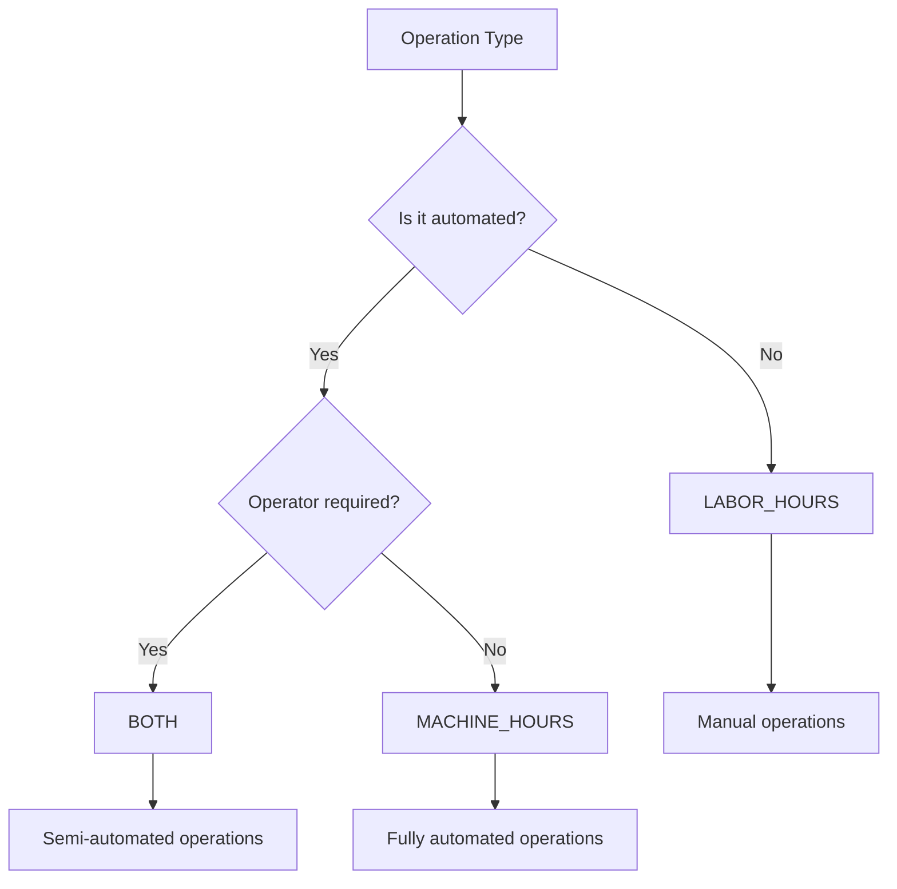

# Machine Time Costing & Reporting Guide

## Overview

The Machine Time Costing system provides comprehensive cost calculation and reporting capabilities for manufacturing operations. This guide covers the various costing models, overhead allocation strategies, and reporting features available in the system.

## Costing Models

### Model Comparison

| Model | Description | Use Case | Formula |
|-------|-------------|----------|---------|
| LABOR_HOURS | Labor cost only | Manual operations | Labor Hours × Labor Rate |
| MACHINE_HOURS | Machine cost only | Automated operations | Machine Hours × Machine Rate |
| BOTH | Combined costing | Semi-automated operations | (Labor Hours × Labor Rate) + (Machine Hours × Machine Rate) |

### Selecting the Right Costing Model



## Labor Hours Costing

### Configuration

```json
{
  "costingModel": "LABOR_HOURS",
  "laborRates": {
    "standard": 35.00,
    "overtime": 52.50,
    "weekend": 70.00,
    "holiday": 105.00
  },
  "shiftDifferentials": {
    "day": 1.0,
    "evening": 1.15,
    "night": 1.25
  },
  "skillLevels": {
    "apprentice": 0.75,
    "journeyman": 1.0,
    "master": 1.35,
    "specialist": 1.5
  }
}
```

### Labor Cost Calculation Example

```javascript
class LaborCostCalculator {
  calculateLaborCost(timeEntry) {
    const baseRate = this.getBaseRate(timeEntry.operatorId);
    const shiftMultiplier = this.getShiftMultiplier(timeEntry.startTime);
    const overtimeMultiplier = this.getOvertimeMultiplier(timeEntry.duration);
    const skillMultiplier = this.getSkillMultiplier(timeEntry.operatorId);

    const effectiveRate = baseRate * shiftMultiplier * overtimeMultiplier * skillMultiplier;
    const laborCost = timeEntry.duration * effectiveRate;

    return {
      baseRate: baseRate,
      effectiveRate: effectiveRate,
      duration: timeEntry.duration,
      laborCost: laborCost,
      breakdown: {
        regular: this.calculateRegularHours(timeEntry) * baseRate,
        overtime: this.calculateOvertimeHours(timeEntry) * baseRate * 1.5,
        shiftDifferential: (effectiveRate - baseRate) * timeEntry.duration
      }
    };
  }

  getOvertimeMultiplier(duration) {
    if (duration <= 8) return 1.0;
    if (duration <= 12) return 1.25;
    return 1.5;
  }
}
```

### Labor Cost Report Example

```json
{
  "reportType": "LABOR_COST_SUMMARY",
  "period": {
    "start": "2024-10-01T00:00:00Z",
    "end": "2024-10-31T23:59:59Z"
  },
  "summary": {
    "totalLaborHours": 3250.5,
    "totalLaborCost": 113767.50,
    "averageHourlyRate": 35.00,
    "effectiveHourlyRate": 38.75
  },
  "byOperator": [
    {
      "operatorId": "op-001",
      "name": "John Smith",
      "skillLevel": "master",
      "hours": 168,
      "regularHours": 160,
      "overtimeHours": 8,
      "cost": 6552.00
    }
  ],
  "byShift": {
    "day": {
      "hours": 2100,
      "cost": 73500.00
    },
    "evening": {
      "hours": 850,
      "cost": 34212.50
    },
    "night": {
      "hours": 300.5,
      "cost": 13162.00
    }
  }
}
```

## Machine Hours Costing

### Configuration

```json
{
  "costingModel": "MACHINE_HOURS",
  "machineRates": {
    "cnc_mill": {
      "baseRate": 125.00,
      "setupRate": 85.00,
      "idleRate": 35.00
    },
    "cnc_lathe": {
      "baseRate": 110.00,
      "setupRate": 75.00,
      "idleRate": 30.00
    },
    "3d_printer": {
      "baseRate": 45.00,
      "setupRate": 25.00,
      "idleRate": 15.00
    }
  },
  "depreciationMethod": "STRAIGHT_LINE",
  "includeEnergyCost": true,
  "includeMaintenance": true,
  "includeTooling": true
}
```

### Machine Cost Components

```javascript
class MachineCostCalculator {
  calculateMachineCost(timeEntry, equipment) {
    const components = {
      baseOperatingCost: this.calculateBaseOperatingCost(timeEntry, equipment),
      depreciation: this.calculateDepreciation(equipment, timeEntry.duration),
      energy: this.calculateEnergyCost(equipment, timeEntry.duration),
      maintenance: this.calculateMaintenanceCost(equipment, timeEntry.duration),
      tooling: this.calculateToolingCost(timeEntry),
      consumables: this.calculateConsumablesCost(timeEntry)
    };

    const totalCost = Object.values(components).reduce((sum, cost) => sum + cost, 0);

    return {
      totalCost: totalCost,
      costPerHour: totalCost / timeEntry.duration,
      components: components,
      equipment: {
        id: equipment.id,
        name: equipment.name,
        type: equipment.type
      }
    };
  }

  calculateDepreciation(equipment, hours) {
    const purchasePrice = equipment.purchasePrice || 500000;
    const salvageValue = equipment.salvageValue || 50000;
    const usefulLifeHours = equipment.usefulLifeHours || 20000;

    switch (this.config.depreciationMethod) {
      case 'STRAIGHT_LINE':
        return ((purchasePrice - salvageValue) / usefulLifeHours) * hours;

      case 'DECLINING_BALANCE':
        const rate = 2 / (usefulLifeHours / 2000); // Annual rate
        const currentValue = purchasePrice * Math.pow(1 - rate, equipment.age);
        return currentValue * rate * (hours / 2000);

      case 'UNITS_OF_PRODUCTION':
        const depreciationPerUnit = (purchasePrice - salvageValue) / equipment.totalExpectedUnits;
        return depreciationPerUnit * timeEntry.partCount;

      default:
        return 0;
    }
  }

  calculateEnergyCost(equipment, hours) {
    const powerConsumption = equipment.powerKW || 15; // kW
    const energyRate = this.config.energyRatePerKWH || 0.12; // $/kWh
    const loadFactor = equipment.loadFactor || 0.7; // 70% average load

    return powerConsumption * hours * energyRate * loadFactor;
  }

  calculateMaintenanceCost(equipment, hours) {
    const annualMaintenanceCost = equipment.annualMaintenanceCost || 15000;
    const annualOperatingHours = 2000;

    return (annualMaintenanceCost / annualOperatingHours) * hours;
  }
}
```

### Machine Utilization Cost Analysis

```json
{
  "reportType": "MACHINE_UTILIZATION_COST",
  "equipmentId": "equip-cnc-001",
  "period": {
    "start": "2024-10-01T00:00:00Z",
    "end": "2024-10-31T23:59:59Z"
  },
  "utilization": {
    "availableHours": 744,
    "scheduledHours": 600,
    "actualRunHours": 512.5,
    "setupHours": 45.3,
    "idleHours": 42.2,
    "utilizationRate": 0.854
  },
  "costs": {
    "runningCost": {
      "hours": 512.5,
      "rate": 125.00,
      "total": 64062.50
    },
    "setupCost": {
      "hours": 45.3,
      "rate": 85.00,
      "total": 3850.50
    },
    "idleCost": {
      "hours": 42.2,
      "rate": 35.00,
      "total": 1477.00
    },
    "totalCost": 69390.00,
    "costPerProductiveHour": 135.39,
    "costPerScheduledHour": 115.65
  }
}
```

## Combined Costing (BOTH)

### Configuration for Semi-Automated Operations

```json
{
  "costingModel": "BOTH",
  "laborAllocation": {
    "setup": 1.0,      // 100% labor during setup
    "running": 0.25,   // 25% labor during running
    "teardown": 1.0,   // 100% labor during teardown
    "monitoring": 0.1  // 10% labor for monitoring
  },
  "machineAllocation": {
    "setup": 1.0,      // Machine running during setup
    "running": 1.0,    // Machine running during operation
    "teardown": 0.5,   // Machine at reduced rate during teardown
    "idle": 0.3        // Machine idle cost rate
  }
}
```

### Combined Cost Calculation

```javascript
class CombinedCostCalculator {
  calculateCombinedCost(timeEntry, equipment, operator) {
    const phases = this.identifyPhases(timeEntry);
    let totalCost = 0;
    let details = [];

    for (const phase of phases) {
      const laborCost = this.calculatePhaseLaborCost(phase, operator);
      const machineCost = this.calculatePhaseMachineCost(phase, equipment);

      totalCost += laborCost + machineCost;

      details.push({
        phase: phase.type,
        duration: phase.duration,
        laborCost: laborCost,
        machineCost: machineCost,
        totalCost: laborCost + machineCost
      });
    }

    return {
      totalCost: totalCost,
      laborComponent: details.reduce((sum, d) => sum + d.laborCost, 0),
      machineComponent: details.reduce((sum, d) => sum + d.machineCost, 0),
      phaseDetails: details,
      costPerUnit: timeEntry.partCount > 0 ? totalCost / timeEntry.partCount : null
    };
  }

  identifyPhases(timeEntry) {
    // Analyze signals to identify operational phases
    return [
      { type: 'setup', duration: 0.5, startTime: timeEntry.startTime },
      { type: 'running', duration: 3.5, startTime: new Date(timeEntry.startTime.getTime() + 30 * 60000) },
      { type: 'teardown', duration: 0.25, startTime: new Date(timeEntry.endTime.getTime() - 15 * 60000) }
    ];
  }
}
```

## Overhead Allocation

### Overhead Configuration

```json
{
  "overheadAllocation": {
    "method": "ACTIVITY_BASED",
    "overheadPools": {
      "facilityOverhead": {
        "annualCost": 500000,
        "allocationBase": "MACHINE_HOURS",
        "rate": 25.00
      },
      "qualityControl": {
        "annualCost": 120000,
        "allocationBase": "PART_COUNT",
        "rate": 2.50
      },
      "engineering": {
        "annualCost": 200000,
        "allocationBase": "SETUP_COUNT",
        "rate": 150.00
      },
      "administration": {
        "annualCost": 180000,
        "allocationBase": "DIRECT_COST",
        "rate": 0.15
      }
    }
  }
}
```

### Activity-Based Costing (ABC)

```javascript
class ActivityBasedCosting {
  allocateOverhead(timeEntry, costPools) {
    const allocations = [];

    for (const [poolName, pool] of Object.entries(costPools)) {
      let allocation = 0;

      switch (pool.allocationBase) {
        case 'MACHINE_HOURS':
          allocation = timeEntry.duration * pool.rate;
          break;

        case 'PART_COUNT':
          allocation = timeEntry.partCount * pool.rate;
          break;

        case 'SETUP_COUNT':
          allocation = timeEntry.setupCount * pool.rate;
          break;

        case 'DIRECT_COST':
          const directCost = timeEntry.laborCost + timeEntry.machineCost;
          allocation = directCost * pool.rate;
          break;

        case 'FLOOR_SPACE':
          allocation = equipment.floorSpace * pool.rate * timeEntry.duration;
          break;
      }

      allocations.push({
        pool: poolName,
        base: pool.allocationBase,
        rate: pool.rate,
        allocation: allocation
      });
    }

    return {
      totalOverhead: allocations.reduce((sum, a) => sum + a.allocation, 0),
      allocations: allocations
    };
  }
}
```

### Traditional Overhead Allocation

```javascript
class TraditionalOverheadAllocation {
  allocateOverhead(directCost, overheadRate) {
    return {
      method: 'TRADITIONAL',
      directCost: directCost,
      overheadRate: overheadRate,
      overheadCost: directCost * overheadRate,
      totalCost: directCost * (1 + overheadRate)
    };
  }

  calculatePlantWideRate(totalOverheadCost, totalAllocationBase) {
    return totalOverheadCost / totalAllocationBase;
  }

  calculateDepartmentalRates(departments) {
    const rates = {};

    for (const dept of departments) {
      rates[dept.name] = {
        overheadCost: dept.overheadCost,
        allocationBase: dept.allocationBase,
        rate: dept.overheadCost / dept.allocationBase
      };
    }

    return rates;
  }
}
```

## Cost Center Tracking

### Cost Center Configuration

```json
{
  "costCenters": {
    "CC-100": {
      "name": "CNC Machining",
      "type": "PRODUCTION",
      "equipment": ["equip-cnc-001", "equip-cnc-002"],
      "budget": 150000,
      "allocationMethod": "MACHINE_HOURS"
    },
    "CC-200": {
      "name": "Assembly",
      "type": "PRODUCTION",
      "equipment": ["equip-asm-001"],
      "budget": 80000,
      "allocationMethod": "LABOR_HOURS"
    },
    "CC-300": {
      "name": "Quality Control",
      "type": "SUPPORT",
      "budget": 50000,
      "allocationMethod": "PART_COUNT"
    }
  }
}
```

### Cost Center Analysis

```javascript
class CostCenterAnalyzer {
  analyzeCostCenter(costCenterId, period) {
    const costCenter = this.getCostCenter(costCenterId);
    const entries = this.getTimeEntries(costCenter.equipment, period);

    const analysis = {
      costCenter: costCenter.name,
      period: period,
      budget: costCenter.budget,
      actual: 0,
      variance: 0,
      equipment: [],
      products: [],
      trends: []
    };

    // Calculate actual costs
    for (const entry of entries) {
      const cost = this.calculateEntryCost(entry);
      analysis.actual += cost.totalCost;

      // Group by equipment
      const equipSummary = analysis.equipment.find(e => e.id === entry.equipmentId);
      if (equipSummary) {
        equipSummary.cost += cost.totalCost;
        equipSummary.hours += entry.duration;
      } else {
        analysis.equipment.push({
          id: entry.equipmentId,
          cost: cost.totalCost,
          hours: entry.duration
        });
      }
    }

    analysis.variance = analysis.budget - analysis.actual;
    analysis.variancePercent = (analysis.variance / analysis.budget) * 100;

    return analysis;
  }
}
```

## Cost Variance Analysis

### Variance Types

```javascript
const varianceTypes = {
  PRICE_VARIANCE: 'Difference between standard and actual rates',
  EFFICIENCY_VARIANCE: 'Difference between standard and actual hours',
  VOLUME_VARIANCE: 'Difference between budgeted and actual production',
  MIX_VARIANCE: 'Difference in product mix from plan',
  YIELD_VARIANCE: 'Difference in output from input'
};
```

### Variance Calculation

```javascript
class VarianceAnalyzer {
  calculateVariances(actual, standard) {
    const variances = {
      total: actual.totalCost - standard.totalCost,
      components: {}
    };

    // Price variance
    variances.components.price = this.calculatePriceVariance(actual, standard);

    // Efficiency variance
    variances.components.efficiency = this.calculateEfficiencyVariance(actual, standard);

    // Volume variance
    variances.components.volume = this.calculateVolumeVariance(actual, standard);

    // Labor variances
    variances.components.labor = {
      rate: (actual.laborRate - standard.laborRate) * actual.laborHours,
      efficiency: (actual.laborHours - standard.laborHours) * standard.laborRate
    };

    // Machine variances
    variances.components.machine = {
      rate: (actual.machineRate - standard.machineRate) * actual.machineHours,
      utilization: (actual.utilization - standard.utilization) * standard.machineRate * actual.availableHours
    };

    // Overhead variances
    variances.components.overhead = {
      spending: actual.overheadCost - (standard.overheadRate * actual.allocationBase),
      efficiency: (actual.allocationBase - standard.allocationBase) * standard.overheadRate
    };

    return variances;
  }

  analyzeVarianceCauses(variances) {
    const causes = [];

    if (Math.abs(variances.components.price) > 1000) {
      causes.push({
        type: 'PRICE_VARIANCE',
        amount: variances.components.price,
        possibleCauses: [
          'Rate changes not updated in standards',
          'Overtime premium not budgeted',
          'Supplier price increases'
        ]
      });
    }

    if (Math.abs(variances.components.efficiency) > 500) {
      causes.push({
        type: 'EFFICIENCY_VARIANCE',
        amount: variances.components.efficiency,
        possibleCauses: [
          'Machine breakdowns',
          'Operator skill differences',
          'Material quality issues',
          'Setup time overruns'
        ]
      });
    }

    return causes;
  }
}
```

### Variance Report Example

```json
{
  "reportType": "COST_VARIANCE_ANALYSIS",
  "period": "2024-10",
  "summary": {
    "standardCost": 250000,
    "actualCost": 267500,
    "totalVariance": 17500,
    "variancePercent": 7.0
  },
  "variances": {
    "labor": {
      "rateVariance": 2500,
      "efficiencyVariance": 3200,
      "totalVariance": 5700,
      "analysis": "Unfavorable due to overtime and training time"
    },
    "machine": {
      "rateVariance": -500,
      "utilizationVariance": 8300,
      "totalVariance": 7800,
      "analysis": "Poor utilization due to maintenance issues"
    },
    "material": {
      "priceVariance": 1500,
      "usageVariance": 2000,
      "totalVariance": 3500,
      "analysis": "Higher scrap rate than standard"
    },
    "overhead": {
      "spendingVariance": 500,
      "efficiencyVariance": 0,
      "totalVariance": 500,
      "analysis": "Within acceptable range"
    }
  },
  "recommendations": [
    "Review and update standard rates quarterly",
    "Implement preventive maintenance program",
    "Provide additional operator training",
    "Investigate material quality with suppliers"
  ]
}
```

## Report Generation

### Available Report Types

```javascript
const reportTypes = {
  DAILY_PRODUCTION_COST: 'Daily summary of production costs',
  WEEKLY_EFFICIENCY: 'Weekly machine and labor efficiency',
  MONTHLY_VARIANCE: 'Monthly cost variance analysis',
  PRODUCT_COSTING: 'Cost breakdown by product',
  EQUIPMENT_PROFITABILITY: 'Equipment ROI and profitability',
  COST_CENTER_PERFORMANCE: 'Cost center budget vs actual',
  OPERATOR_PRODUCTIVITY: 'Operator efficiency and costs',
  JOB_COSTING: 'Detailed job/work order costs'
};
```

### Report Generation API

```javascript
class ReportGenerator {
  async generateReport(reportType, parameters) {
    const report = {
      id: generateReportId(),
      type: reportType,
      generatedAt: new Date(),
      parameters: parameters,
      data: {}
    };

    switch (reportType) {
      case 'DAILY_PRODUCTION_COST':
        report.data = await this.generateDailyProductionCost(parameters);
        break;

      case 'PRODUCT_COSTING':
        report.data = await this.generateProductCosting(parameters);
        break;

      case 'EQUIPMENT_PROFITABILITY':
        report.data = await this.generateEquipmentProfitability(parameters);
        break;
    }

    // Save report for future reference
    await this.saveReport(report);

    return report;
  }

  async generateProductCosting(params) {
    const { productId, startDate, endDate } = params;

    const entries = await this.getProductTimeEntries(productId, startDate, endDate);
    const costs = {
      direct: {
        labor: 0,
        machine: 0,
        material: 0
      },
      overhead: 0,
      total: 0,
      perUnit: 0
    };

    for (const entry of entries) {
      const cost = await this.calculateEntryCost(entry);
      costs.direct.labor += cost.laborCost;
      costs.direct.machine += cost.machineCost;
      costs.overhead += cost.overheadCost;
    }

    costs.direct.material = await this.getMaterialCost(productId, startDate, endDate);
    costs.total = costs.direct.labor + costs.direct.machine +
                  costs.direct.material + costs.overhead;

    const unitsProduced = await this.getUnitsProduced(productId, startDate, endDate);
    costs.perUnit = costs.total / unitsProduced;

    return {
      product: await this.getProductInfo(productId),
      period: { startDate, endDate },
      costs: costs,
      unitsProduced: unitsProduced,
      breakdown: await this.generateCostBreakdown(entries)
    };
  }
}
```

### Daily Production Cost Report

```json
{
  "reportType": "DAILY_PRODUCTION_COST",
  "date": "2024-10-31",
  "summary": {
    "totalCost": 15234.67,
    "totalHours": 85.5,
    "totalParts": 1250,
    "averageCostPerHour": 178.18,
    "averageCostPerPart": 12.19
  },
  "byShift": [
    {
      "shift": "DAY",
      "hours": 45,
      "cost": 7425.00,
      "parts": 750,
      "efficiency": 0.92
    },
    {
      "shift": "EVENING",
      "hours": 40.5,
      "cost": 7809.67,
      "parts": 500,
      "efficiency": 0.78
    }
  ],
  "byEquipment": [
    {
      "equipmentId": "equip-cnc-001",
      "name": "CNC Mill #1",
      "hours": 22.5,
      "cost": 4312.50,
      "parts": 425
    },
    {
      "equipmentId": "equip-cnc-002",
      "name": "CNC Mill #2",
      "hours": 21.0,
      "cost": 3885.00,
      "parts": 380
    }
  ],
  "byProduct": [
    {
      "productId": "prod-xyz-789",
      "name": "Widget XYZ",
      "quantity": 650,
      "cost": 7800.00,
      "unitCost": 12.00
    }
  ],
  "trends": {
    "vsYesterday": {
      "cost": 2.5,
      "efficiency": -1.2,
      "parts": 5.0
    },
    "vsLastWeek": {
      "cost": -3.2,
      "efficiency": 2.1,
      "parts": 8.5
    }
  }
}
```

### Equipment Profitability Report

```json
{
  "reportType": "EQUIPMENT_PROFITABILITY",
  "equipmentId": "equip-cnc-001",
  "period": {
    "start": "2024-01-01",
    "end": "2024-10-31"
  },
  "financial": {
    "revenue": {
      "jobRevenue": 850000,
      "scrapValue": 5000,
      "totalRevenue": 855000
    },
    "costs": {
      "directLabor": 125000,
      "machineOperation": 185000,
      "maintenance": 25000,
      "tooling": 15000,
      "energy": 18000,
      "depreciation": 41667,
      "overhead": 52500,
      "totalCosts": 462167
    },
    "profit": {
      "grossProfit": 392833,
      "profitMargin": 45.9,
      "roi": 18.7
    }
  },
  "operational": {
    "totalHours": 6800,
    "productiveHours": 5780,
    "utilization": 0.85,
    "oee": 0.72,
    "revenuePerHour": 125.74,
    "costPerHour": 67.97,
    "profitPerHour": 57.77
  },
  "comparison": {
    "vsBudget": {
      "revenue": 105.2,
      "costs": 98.5,
      "profit": 112.3
    },
    "vsSimilarEquipment": {
      "utilization": 108.5,
      "costPerHour": 92.3,
      "profitability": 115.7
    }
  }
}
```

## Export Formats

### CSV Export

```csv
Date,Equipment,Work Order,Operation,Start Time,End Time,Duration,Machine Cost,Labor Cost,Overhead,Total Cost
2024-10-31,CNC-001,WO-1234,OP-5678,08:00:00,12:00:00,4.00,500.00,140.00,96.00,736.00
2024-10-31,CNC-002,WO-1235,OP-5679,08:30:00,11:45:00,3.25,357.50,113.75,70.88,542.13
```

### JSON Export

```json
{
  "export": {
    "type": "COST_DATA",
    "format": "JSON",
    "version": "1.0",
    "generated": "2024-10-31T15:00:00Z"
  },
  "data": [
    {
      "id": "mte-001",
      "date": "2024-10-31",
      "equipment": {
        "id": "equip-cnc-001",
        "name": "CNC Mill #1"
      },
      "workOrder": "WO-1234",
      "costs": {
        "machine": 500.00,
        "labor": 140.00,
        "overhead": 96.00,
        "total": 736.00
      }
    }
  ]
}
```

### Excel Export Structure

```
Sheet 1: Summary
- Period Summary
- Total Costs
- Key Metrics

Sheet 2: Detailed Costs
- Time Entry Details
- Cost Breakdowns
- Variance Analysis

Sheet 3: Equipment Analysis
- Utilization Metrics
- Cost per Equipment
- Profitability

Sheet 4: Charts
- Cost Trends
- Utilization Charts
- Variance Charts
```

## Best Practices for Cost Analysis

### 1. Regular Cost Review

```javascript
const costReviewSchedule = {
  daily: ['Production costs', 'Labor efficiency'],
  weekly: ['Equipment utilization', 'Cost variances'],
  monthly: ['Overhead allocation', 'Product profitability'],
  quarterly: ['Standard cost updates', 'ROI analysis'],
  annually: ['Depreciation rates', 'Cost model evaluation']
};
```

### 2. Cost Control Measures

```javascript
class CostController {
  implementControls() {
    return {
      alerts: {
        costOverrun: 'Alert when costs exceed budget by 5%',
        inefficiency: 'Alert when efficiency drops below 85%',
        idleTime: 'Alert when idle time exceeds 10%'
      },

      approvals: {
        overtime: 'Require approval for overtime work',
        setupExtension: 'Require approval for setup > 2 hours',
        scrapRate: 'Escalate when scrap > 3%'
      },

      automation: {
        autoStop: 'Automatically stop idle machines after 15 minutes',
        shiftOptimization: 'Optimize shift assignments based on cost',
        batchOptimization: 'Optimize batch sizes for cost efficiency'
      }
    };
  }
}
```

### 3. Continuous Improvement

```javascript
const improvementMetrics = {
  costReduction: {
    target: '5% year-over-year',
    tracking: 'Monthly',
    initiatives: [
      'Process optimization',
      'Automation implementation',
      'Waste reduction'
    ]
  },

  efficiencyGains: {
    target: '10% improvement',
    tracking: 'Weekly',
    initiatives: [
      'Setup time reduction',
      'Operator training',
      'Preventive maintenance'
    ]
  }
};
```

## Security and Compliance

### Cost Data Security

- Encrypt sensitive cost information at rest and in transit
- Implement role-based access control for cost reports
- Audit trail for all cost adjustments
- Regular backups of cost data

### Compliance Requirements

- GAAP compliance for cost accounting
- SOX compliance for financial reporting
- ISO 9001 for quality management
- Industry-specific regulations

### Data Retention

```javascript
const retentionPolicy = {
  timeEntries: '7 years',
  costReports: '7 years',
  summaryData: '10 years',
  auditLogs: '10 years',
  archivalFormat: 'READ_ONLY_DATABASE',
  purgeSchedule: 'ANNUAL'
};
```