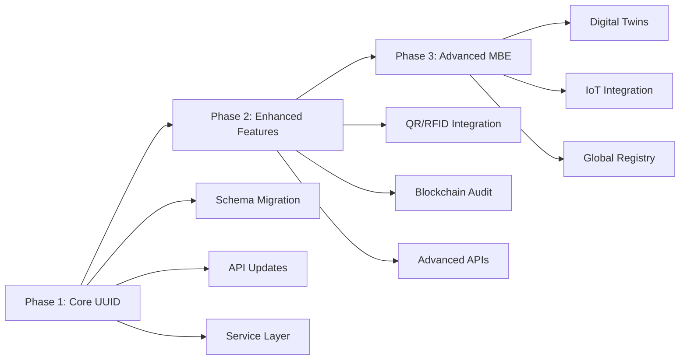

# MBE Persistent UUID Strategy & Migration Guide

## Overview

This document provides a comprehensive guide for implementing persistent UUIDs in the MachShop MES platform to achieve NIST AMS 300-12 compliance for Model-Based Enterprise (MBE) traceability.

## Table of Contents

1. [Background & Requirements](#background--requirements)
2. [Implementation Strategy](#implementation-strategy)
3. [Technical Architecture](#technical-architecture)
4. [API Usage Guide](#api-usage-guide)
5. [Database Schema Changes](#database-schema-changes)
6. [Migration Guide](#migration-guide)
7. [Testing Strategy](#testing-strategy)
8. [Compliance Verification](#compliance-verification)
9. [Troubleshooting](#troubleshooting)
10. [Future Enhancements](#future-enhancements)

## Background & Requirements

### Regulatory Compliance

**NIST AMS 300-12 (August 2024)**: Research Results and Recommendations for Universally Unique Identifiers in Product Data Standards

> "NIST publishes recommendations to use Universally Unique Identifiers (UUIDs) in Manufacturing Life Cycle Data to address findability of data in multi-domain and multi-life-cycle engineering and manufacturing contexts."

### Standards Compliance

- **ISO/IEC 9834-8:2005**: UUID standard for aerospace parts
- **AS9100/ISO 9001**: Regulatory traceability requirements
- **ITAR/Export Control**: Persistent identification for controlled items
- **FAA/EASA Requirements**: Aerospace component traceability
- **STEP AP242**: CAD model persistent identification
- **QIF Standard**: Quality measurement data identification

### Business Drivers

- **Cross-enterprise collaboration**: Unique identification across suppliers/customers
- **Digital thread continuity**: Persistent IDs throughout product lifecycle
- **Long-term archival (LOTAR)**: Ensure 50+ year data accessibility
- **Supply chain transparency**: Enable end-to-end traceability
- **Regulatory audits**: Simplified compliance verification

## Implementation Strategy

### Hybrid Approach

We implemented a **hybrid approach** that maintains existing performance while adding MBE compliance:

```prisma
model Part {
  id                String   @id @default(cuid())         // Internal DB operations
  persistentUuid    String?  @default(uuid())             // MBE/External integration
  partNumber        String   @unique
  // ... other fields

  @@index([persistentUuid])
}
```

### Key Benefits

1. **Performance**: Existing CUID-based operations remain unchanged
2. **Compliance**: New UUID fields provide NIST compliance
3. **Compatibility**: No breaking changes to existing APIs
4. **Flexibility**: Support for both internal and external identification

## Technical Architecture

### Core Components

#### 1. UUID Utilities (`src/utils/uuidUtils.ts`)

```typescript
import { generatePersistentUUID, isValidPersistentUUID } from '../utils/uuidUtils';

// Generate new UUID
const uuid = generatePersistentUUID();

// Validate UUID format
if (isValidPersistentUUID(uuid)) {
  // Process valid UUID
}

// Normalize UUID (lowercase, trimmed)
const normalized = normalizePersistentUUID(uuid);
```

#### 2. Service Layer Methods

```typescript
// ProductService
await productService.getPartByPersistentUuid(uuid);

// WorkOrderService
await workOrderService.getWorkOrderByPersistentUuid(uuid);

// MaterialService
await materialService.getMaterialLotByPersistentUuid(uuid);
```

#### 3. API Endpoints

```http
GET /api/v1/products/uuid/{persistentUuid}
GET /api/v1/work-orders/uuid/{persistentUuid}
GET /api/v1/materials/lots/uuid/{persistentUuid}
```

## API Usage Guide

### Getting Started

#### 1. Retrieve Entity by UUID

```bash
# Get part by persistent UUID
curl -X GET "https://api.machshop.com/api/v1/products/uuid/123e4567-e89b-12d3-a456-426614174000" \
  -H "Authorization: Bearer YOUR_TOKEN"
```

Response:
```json
{
  "id": "clkj123abc",
  "persistentUuid": "123e4567-e89b-12d3-a456-426614174000",
  "partNumber": "ENG-001-BLADE",
  "partName": "High-Pressure Turbine Blade Stage 1",
  "description": "Safety-critical rotating component",
  "partType": "COMPONENT",
  "specifications": [...],
  "bomItems": [...],
  "serializedParts": [...]
}
```

#### 2. UUID Validation

```typescript
import { isValidPersistentUUID } from '../utils/uuidUtils';

function validateInput(uuid: string) {
  if (!isValidPersistentUUID(uuid)) {
    throw new Error('Invalid UUID format - must be UUID v4');
  }
  return uuid;
}
```

#### 3. Cross-Enterprise Integration

```typescript
// Format for different standards
import { formatForSTEP, formatForQIF, formatForITAR } from '../utils/uuidUtils';

const stepUrn = formatForSTEP(uuid);        // urn:uuid:123e4567-...
const qifUrn = formatForQIF(uuid);          // urn:uuid:123e4567-...
const itarId = formatForITAR(uuid);         // ITAR-UUID:123E4567-...
```

## Database Schema Changes

### Affected Entities

| Entity | Purpose | Criticality |
|--------|---------|-------------|
| Part | Product identification | High |
| SerializedPart | Instance traceability | High |
| MaterialLot | Supply chain tracking | High |
| WorkOrder | Manufacturing execution | Medium |
| BOMItem | Configuration management | Medium |
| Operation | Process traceability | Medium |
| Routing | Manufacturing sequences | Medium |
| PartGenealogy | Assembly relationships | Medium |

### Schema Updates

```sql
-- Example for Part table
ALTER TABLE parts ADD COLUMN persistent_uuid UUID DEFAULT gen_random_uuid();
CREATE INDEX idx_parts_persistent_uuid ON parts(persistent_uuid);

-- Example for SerializedPart table
ALTER TABLE serialized_parts ADD COLUMN persistent_uuid UUID DEFAULT gen_random_uuid();
CREATE INDEX idx_serialized_parts_persistent_uuid ON serialized_parts(persistent_uuid);
```

### Indexes

All persistent UUID fields have dedicated indexes for performance:

```prisma
@@index([persistentUuid])
```

## Migration Guide

### For Existing Data

#### Step 1: Database Migration

```bash
# Apply schema changes
npx prisma db push

# Verify migration
npx prisma studio
```

#### Step 2: Backfill UUIDs

Existing records automatically receive UUIDs via `@default(uuid())`.

```sql
-- Verify UUID generation
SELECT
  id,
  persistent_uuid,
  part_number
FROM parts
WHERE persistent_uuid IS NOT NULL
LIMIT 10;
```

#### Step 3: API Integration

Update client applications to use new UUID endpoints:

```typescript
// Before: Internal ID lookup
const part = await api.get(`/products/${internalId}`);

// After: UUID lookup (recommended for external systems)
const part = await api.get(`/products/uuid/${persistentUuid}`);
```

### For New Applications

New applications should prioritize UUID-based endpoints:

```typescript
class PartService {
  // Preferred: UUID-based lookup
  async getPartByUuid(uuid: string) {
    return this.api.get(`/products/uuid/${uuid}`);
  }

  // Legacy: Internal ID lookup
  async getPartById(id: string) {
    return this.api.get(`/products/${id}`);
  }
}
```

## Testing Strategy

### Unit Tests

```bash
# Run UUID utility tests
npm test src/tests/utils/uuidUtils.test.ts

# Run service UUID tests
npm test src/tests/services/ProductService-UUID.test.ts
```

### Integration Tests

```bash
# Test API endpoints
npm test src/tests/routes/products-uuid.test.ts
```

### Compliance Tests

Verify NIST AMS 300-12 compliance:

```typescript
describe('NIST Compliance', () => {
  it('should generate UUID v4 format', () => {
    const uuid = generatePersistentUUID();
    expect(uuid).toMatch(/^[0-9a-f]{8}-[0-9a-f]{4}-4[0-9a-f]{3}-[89ab][0-9a-f]{3}-[0-9a-f]{12}$/i);
  });

  it('should enable cross-enterprise identification', () => {
    // Test implementation
  });
});
```

## Compliance Verification

### NIST AMS 300-12 Checklist

- ✅ **UUID v4 Format**: All UUIDs use RFC 4122 v4 format
- ✅ **Global Uniqueness**: UUIDs are globally unique across enterprises
- ✅ **Persistence**: UUIDs remain constant throughout product lifecycle
- ✅ **Findability**: UUIDs enable data discovery across systems
- ✅ **Interoperability**: Standard format enables cross-platform exchange

### Verification Commands

```bash
# Verify UUID format
npm run test:uuid-compliance

# Check database consistency
npm run verify:uuid-integrity

# Test API compliance
npm run test:api-uuid-compliance
```

### Audit Trail

```sql
-- Generate compliance report
SELECT
  'Part' as entity_type,
  COUNT(*) as total_records,
  COUNT(persistent_uuid) as uuid_records,
  ROUND(COUNT(persistent_uuid) * 100.0 / COUNT(*), 2) as coverage_percentage
FROM parts
UNION ALL
SELECT
  'SerializedPart',
  COUNT(*),
  COUNT(persistent_uuid),
  ROUND(COUNT(persistent_uuid) * 100.0 / COUNT(*), 2)
FROM serialized_parts;
```

## Troubleshooting

### Common Issues

#### 1. UUID Validation Errors

**Problem**: `Invalid UUID format` error
**Solution**: Ensure UUID v4 format using validation utilities

```typescript
import { isValidPersistentUUID } from '../utils/uuidUtils';

if (!isValidPersistentUUID(inputUuid)) {
  throw new Error('UUID must be in valid v4 format');
}
```

#### 2. Database Performance

**Problem**: Slow UUID-based queries
**Solution**: Verify indexes are properly created

```sql
-- Check index exists
SELECT indexname FROM pg_indexes WHERE tablename = 'parts' AND indexname LIKE '%uuid%';

-- Create missing index
CREATE INDEX CONCURRENTLY idx_parts_persistent_uuid ON parts(persistent_uuid);
```

#### 3. Case Sensitivity

**Problem**: UUID lookups fail due to case differences
**Solution**: Use normalization utilities

```typescript
import { normalizePersistentUUID } from '../utils/uuidUtils';

const normalizedUuid = normalizePersistentUUID(inputUuid); // Always lowercase
```

### Debugging Commands

```bash
# Test UUID generation
node -e "console.log(require('./src/utils/uuidUtils').generatePersistentUUID())"

# Validate UUID format
node -e "console.log(require('./src/utils/uuidUtils').isValidPersistentUUID('123e4567-e89b-12d3-a456-426614174000'))"

# Check database schema
npx prisma db pull
```

## Future Enhancements

### Phase 2: Enhanced UUID Features

1. **UUID-based API Endpoints**: Migrate all endpoints to UUID-based routing
2. **Blockchain Integration**: UUID-based immutable audit trails
3. **QR Code Integration**: Embed UUIDs in part markings
4. **RFID Integration**: Store UUIDs in RFID tags

### Phase 3: Advanced MBE Features

1. **Digital Twins**: UUID-based digital twin mapping
2. **IoT Integration**: Real-time data streams linked by UUID
3. **AI/ML Integration**: UUID-based training data organization
4. **Global Registry**: Cross-industry UUID registry participation

### Implementation Roadmap



## Best Practices

### Development

1. **Always validate UUIDs** before database operations
2. **Use normalization** for consistent formatting
3. **Prefer UUID endpoints** for external integrations
4. **Include UUIDs in logs** for better traceability
5. **Test both ID and UUID paths** during development

### Production

1. **Monitor UUID performance** via database metrics
2. **Backup UUID mappings** for disaster recovery
3. **Audit UUID compliance** regularly
4. **Document UUID usage** in API documentation
5. **Train teams** on UUID best practices

### Security

1. **UUID format validation** prevents injection attacks
2. **Rate limiting** on UUID endpoints
3. **Access controls** for UUID-based data access
4. **Audit logging** for UUID-based operations

## Support & Resources

### Documentation

- [NIST AMS 300-12 Standard](https://www.nist.gov/publications/ams-300-12)
- [RFC 4122 UUID Specification](https://tools.ietf.org/html/rfc4122)
- [ISO/IEC 9834-8:2005](https://www.iso.org/standard/39838.html)

### Internal Resources

- **API Documentation**: `/docs/api/uuid-endpoints.md`
- **Database Schema**: `/docs/schema/uuid-fields.md`
- **Test Suite**: `/src/tests/utils/uuidUtils.test.ts`

### Contact

- **Technical Issues**: Engineering Team
- **Compliance Questions**: Quality Assurance Team
- **Implementation Support**: DevOps Team

---

**Document Version**: 1.0
**Last Updated**: Current
**Review Cycle**: Quarterly
**Next Review**: Q1 2025